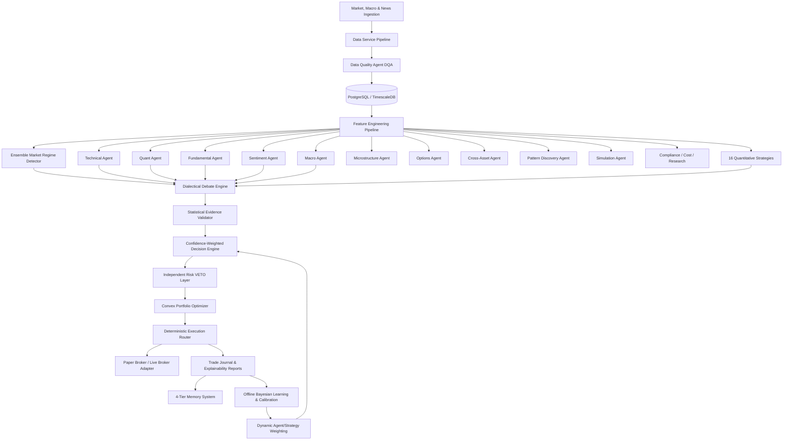

# ATHENA: Institutional Multi-Agent AI Quantitative Trading Platform


ATHENA is an institutional-grade, multi-agent quantitative hedge fund research, portfolio management, and deterministic execution operating system.

---

## 🏛 Core Architectural Principles

1. **Deterministic Execution Layer**: LLMs and analytical models *never* execute trades directly. They propose structured recommendations which must pass an independent evidence validator, convex portfolio optimizer, and an autonomous **Risk Management VETO Layer** before deterministic paper/live order routing.
2. **Safety by Default**: Live execution remains strictly disabled (`LIVE_TRADING_ENABLED=false`, `EXECUTION_MODE=PAPER`).
3. **Multi-Agent Dialectical Debate**: 14 specialized AI agents and 16 quantitative strategies engage in thesis vs. antithesis debates, calculating consensus agreement scores and identifying structural contradictions.
4. **Ensemble Market Regime Detection**: Multi-model Gaussian Hidden Markov Model (HMM), GMM clustering, and ADX/ATR volatility-trend matrix classification.
5. **Zero Look-Ahead Bias Backtesting**: Event-driven historical simulation with transaction costs, slippage, and Monte Carlo forward-path analysis.
6. **Trade Journal & Auto-Explainability**: Complete cryptographic audit trail generating institutional Markdown trade explainability reports.

---

## 📐 System Architecture Diagram



---

## 🚀 Quick Start Guide

### 1. Clone & Setup Python Environment
```bash
# Clone the repository
git clone https://github.com/senti67/Athena.git
cd Athena

# Create & activate virtual environment
python -m venv .venv
source .venv/bin/activate  # On Windows: .venv\Scripts\activate

# Install in editable mode
pip install -e .
```

### 2. Run End-to-End Simulation
Demonstrates full pipeline execution (Data -> Features -> 14 Agents -> 16 Strategies -> Debate -> Decision -> Risk -> Paper Execution -> Trade Journal):
```bash
python scripts/run_simulation.py
```

### 3. Run Event-Driven Backtesting Lab
```bash
python scripts/run_backtest.py
```

### 4. Run Automated Test Suite
```bash
pytest tests/ -v
```

### 5. Launch FastAPI Backend Gateway
```bash
uvicorn apps.api.main:app --host 0.0.0.0 --port 8000 --reload
```
API Documentation: [http://localhost:8000/docs](http://localhost:8000/docs)

### 6. Launch Institutional Next.js Web Dashboard
```bash
cd apps/web
npm install
npm run dev
```
Terminal Dashboard: [http://localhost:3000](http://localhost:3000)

---

## 📦 Monorepo Directory Structure

```text
Athena/
├── apps/
│   ├── api/                     # FastAPI main gateway & REST/WebSocket routes
│   └── web/                     # Next.js 14+ dark terminal trading dashboard
├── packages/
│   ├── schemas/                 # Pydantic v2 schemas for all domain entities
│   ├── database/                # SQLAlchemy 2.0 models & async session factory
│   ├── event_bus/               # Event bus with correlation IDs
│   ├── auth/                    # JWT tokens, password hashing, and RBAC
│   ├── logging/                 # Structured JSON logging & credential redaction
│   ├── monitoring/              # Prometheus metrics & health probes
│   ├── quant/                   # Pure math indicators, risk ratios, & optimizers
│   └── common/                  # Central settings, exceptions, & DI container
├── services/
│   ├── data_service/            # Market/macro ingestion & Data Quality Agent
│   ├── feature_service/         # Multidimensional quantitative feature pipeline
│   ├── agent_service/           # 14 specialized AI analytical & operational agents
│   ├── strategy_service/        # 16 quantitative trading strategies
│   ├── regime_service/          # Multi-model HMM/GMM/Volatility regime ensemble
│   ├── debate_service/          # Dialectical debate & conflict resolution engine
│   ├── validator_service/       # Empirical statistical evidence validator
│   ├── decision_service/        # Confidence-weighted ensemble decision engine
│   ├── risk_service/            # Independent Risk Management VETO layer
│   ├── portfolio_service/       # MPT, Risk Parity, Kelly, and CVaR optimizer
│   ├── execution_service/       # Deterministic router & realistic paper broker
│   ├── memory_service/          # 4-tier memory (Short/Long/Vector/Knowledge)
│   ├── journal_service/         # Trade journal & automated explainability
│   ├── learning_service/        # Offline Bayesian weighting & Platt calibrator
│   ├── backtest_service/        # Event-driven backtester with Monte Carlo (1000 paths)
│   └── notification_service/    # Alerting, webhooks, & circuit breaker alerts
├── infrastructure/
│   ├── docker/                  # Production & development Dockerfiles
│   ├── kubernetes/              # K8s deployment manifests & services
│   ├── monitoring/              # Prometheus configuration
│   └── terraform/               # Cloud infrastructure provisioning
├── tests/
│   ├── unit/                    # Unit tests for agents, strategies, risk, and math
│   ├── integration/             # End-to-end full pipeline tests
│   └── failure/                 # Failure injection tests
├── scripts/                     # Seed scripts, simulation runner, backtest lab
├── docs/                        # Complete institutional documentation suite
├── .env.example
├── docker-compose.yml
├── Makefile
└── README.md
```

---

## 🛡 Risk Management & Kill Switch

ATHENA's Risk Management engine functions as an autonomous, unilateral veto gate:
- **Max Daily Loss**: $5,000 hard stop circuit breaker.
- **Max Single Position Size**: Capped at $50,000 (or 10% NAV).
- **Max Portfolio Exposure**: 100% unleveraged limit.
- **Data Quality Gate**: Feeds with `data_quality_score < 0.80` are rejected immediately.
- **Emergency Kill Switch**: One-click and automated platform-wide execution freeze.

---

## 📚 Institutional Documentation Suite

* [Architecture Guide](docs/ARCHITECTURE.md)
* [REST & WebSocket API Reference](docs/API.md)
* [Database Schema & Time-Series Design](docs/DATABASE.md)
* [14 Specialized AI Agents Guide](docs/AGENTS.md)
* [16 Quantitative Strategies](docs/STRATEGIES.md)
* [Risk Management & Veto Layer](docs/RISK.md)
* [Deterministic Execution & Paper Broker](docs/EXECUTION.md)
* [Event-Driven Backtesting & Monte Carlo](docs/BACKTESTING.md)
* [Offline Bayesian Learning & Calibration](docs/LEARNING.md)
* [Trade Explainability Engine](docs/EXPLAINABILITY.md)
* [Security, Cryptography & RBAC](docs/SECURITY.md)
* [Docker & Kubernetes Deployment](docs/DEPLOYMENT.md)
* [Developer Setup & Contributing](docs/DEVELOPMENT.md)
