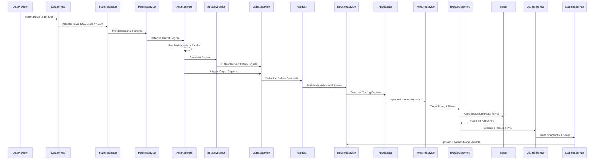

# ATHENA Architecture Guide

## High-Level System Architecture

ATHENA is architected as an institutional-grade quantitative operating system with strict separation between non-deterministic analytical reasoning and deterministic trade execution.

---

## Key Components

### 1. Ingestion & Quality Layer (`services/data_service`)
- Standardized data providers (`MockMarketDataProvider`, `AlphaVantage`, `Polygon`, `YahooFinance`).
- `DataQualityAgent` checks for stale timestamps, price jumps (>40%), crossed spreads, and anomalous bar geometries.
- Produces a `data_quality_score` (0.0 to 1.0). If `data_quality_score < 0.80`, trading is blocked.

### 2. Feature Pipeline (`services/feature_service`)
- Computes Technical, Statistical, Volatility, Liquidity, Options proxy, Cross-Asset, and NLP features.

### 3. AI Agent Framework (`services/agent_service`)
- 14 Specialized Agents running in parallel:
  - Technical, Quant, Fundamental, Sentiment, Macro, Microstructure, Options, Cross-Asset, Pattern Discovery, Simulation, Data Quality, Compliance, Cost Analysis, Research.

### 4. Strategy Engine (`services/strategy_service`)
- 16 Quantitative Trading Strategies:
  - Trend Following, Momentum, Mean Reversion, Swing, Breakout, Pullback, Pairs Trading, Statistical Arbitrage, Sector Rotation, Value, Growth, Event Driven, News Trading, Volatility, ML (LightGBM), RL (PPO).

### 5. Dialectical Debate & Validation Layer (`services/debate_service`, `services/validator_service`)
- Identifies conflicts between momentum and valuation, scores consensus agreement, and validates empirical significance before decision synthesis.

### 6. Risk VETO Layer (`services/risk_service`)
- Unilateral veto authority over all orders. Checks position caps, portfolio exposure, daily loss, drawdown limit, and kill switch.

### 7. Portfolio Optimizer & Execution Router (`services/portfolio_service`, `services/execution_service`)
- MPT, Risk Parity, Kelly Criterion, and CVaR optimization.
- Realistic `PaperBroker` simulating variable slippage, latency, spread, and fees.
- `LiveBrokerAdapter` enforcing `LIVE_TRADING_ENABLED=false` by default.
